# JDBC

## 1.  JDBC简介

面向接口编程：

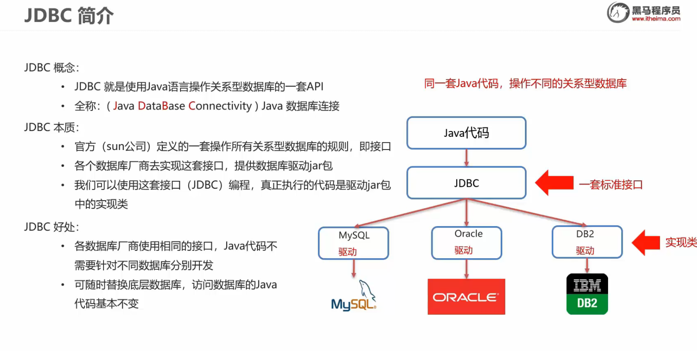

## 2.  JDBC快速入门

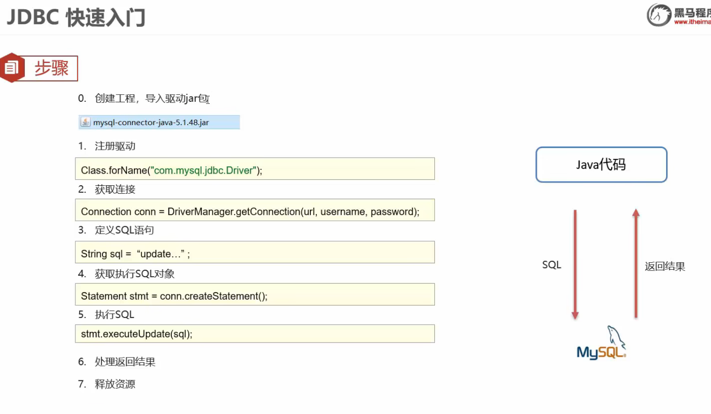

## 3. JDBC API详解

### 3.1 DiverManager的功能

1. 注册驱动：

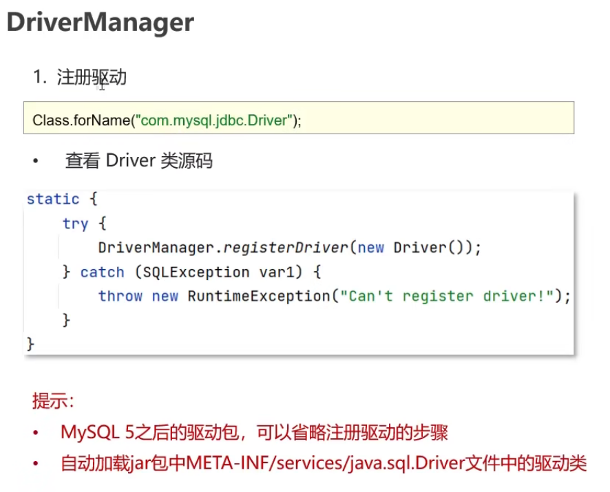

2. 建立与数据库的连接

	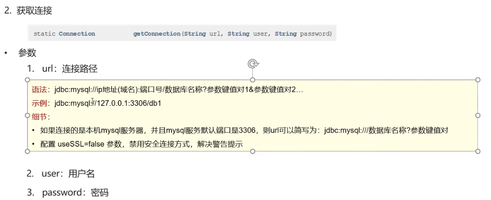

### 3.2 Connection的功能

Connection(数据库连接对象)作用：

1. 获取执行SQL的对象

	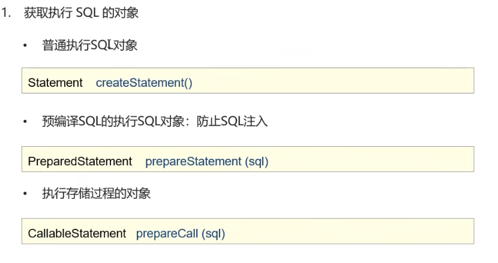

2. 事务处理

	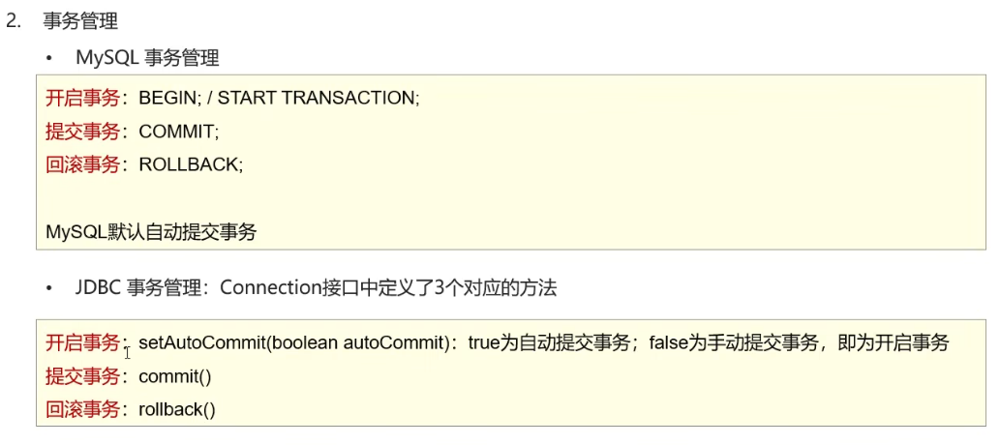

### 3.3 Statement功能

1. 执行SQL语句

	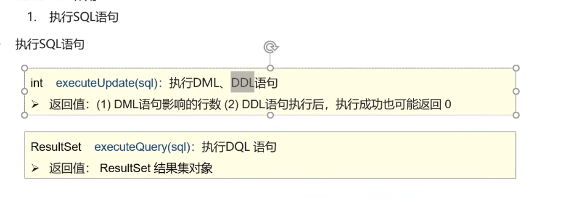

### 3.4 ResultSet功能

1. 获取查询结果

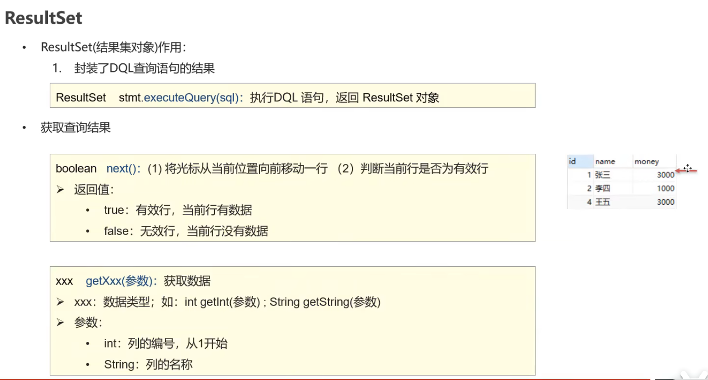

2. 遍历结果集数据

	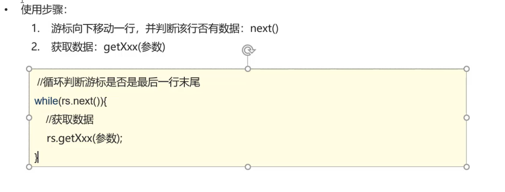

3. 案例

	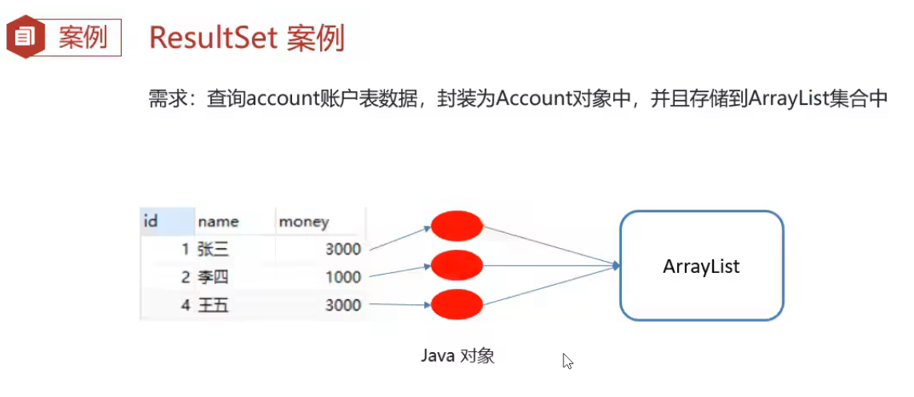

	代码演示：

	```java
	package com.pojo;
	
	public class Student {
	        private String sNo;
	        private String sName;
	        private String sSex;
	        private int sAge;
	        private String sSpecialty;
	        private String sAddress;
	
	    public Student() {
	    }
	
	    public Student(String sNo, String sName, String sSex, int sAge, String sSpecialty, String sAddress) {
	        this.sNo = sNo;
	        this.sName = sName;
	        this.sSex = sSex;
	        this.sAge = sAge;
	        this.sSpecialty = sSpecialty;
	        this.sAddress = sAddress;
	    }
	
	    /**
	     * 获取
	     * @return sNo
	     */
	    public String getSNo() {
	        return sNo;
	    }
	
	    /**
	     * 设置
	     * @param sNo
	     */
	    public void setSNo(String sNo) {
	        this.sNo = sNo;
	    }
	
	    /**
	     * 获取
	     * @return sName
	     */
	    public String getSName() {
	        return sName;
	    }
	
	    /**
	     * 设置
	     * @param sName
	     */
	    public void setSName(String sName) {
	        this.sName = sName;
	    }
	
	    /**
	     * 获取
	     * @return sSex
	     */
	    public String getSSex() {
	        return sSex;
	    }
	
	    /**
	     * 设置
	     * @param sSex
	     */
	    public void setSSex(String sSex) {
	        this.sSex = sSex;
	    }
	
	    /**
	     * 获取
	     * @return sAge
	     */
	    public int getSAge() {
	        return sAge;
	    }
	
	    /**
	     * 设置
	     * @param sAge
	     */
	    public void setSAge(int sAge) {
	        this.sAge = sAge;
	    }
	
	    /**
	     * 获取
	     * @return sSpecialty
	     */
	    public String getSSpecialty() {
	        return sSpecialty;
	    }
	
	    /**
	     * 设置
	     * @param sSpecialty
	     */
	    public void setSSpecialty(String sSpecialty) {
	        this.sSpecialty = sSpecialty;
	    }
	
	    /**
	     * 获取
	     * @return sAddress
	     */
	    public String getSAddress() {
	        return sAddress;
	    }
	
	    /**
	     * 设置
	     * @param sAddress
	     */
	    public void setSAddress(String sAddress) {
	        this.sAddress = sAddress;
	    }
	
	    public String toString() {
	        return "Student{sNo = " + sNo + ", sName = " + sName + ", sSex = " + sSex + ", sAge = " + sAge + ", sSpecialty = " + sSpecialty + ", sAddress = " + sAddress + "}";
	    }
	}
	```

	```java
	package com.pojo;
	
	import java.sql.Connection;
	import java.sql.DriverManager;
	import java.sql.ResultSet;
	import java.sql.Statement;
	import java.util.ArrayList;
	import java.util.List;
	
	public class resultSetTest {
	
	    public static void main(String[] args) throws Exception {
	        //1.注册驱动
	//        Class.forName("com.mysql.cj.jdbc.Driver");
	
	        //2.获取连接
	//        String url = "jdbc:mysql://localhost:3306/infodb";
	//        String url = "jdbc:mysql://127.0.0.1:3306/infodb";
	        String url = "jdbc:mysql:///infodb";
	
	        String username = "root";
	        String password = "123456";
	        Connection conn = DriverManager.getConnection(url,username,password);
	
	        //3.定义SQL语句
	        String sql = "SELECT * FROM student;";
	
	        //4.获取执行对象Statement
	        Statement stmt = conn.createStatement();
	
	        //5.执行sql
	        ResultSet rs = stmt.executeQuery(sql);
	
	        List<Student> list = new ArrayList<>();
	
	        //6.处理结果，遍历
	        while (rs.next()){
	            Student student = new Student();
	
	            String sno = rs.getString("sNo");
	            String name = rs.getString("sName");
	            String sex = rs.getString("sSex");
	            int age = rs.getInt("sAge");
	            String specialty = rs.getString("sSpecialty");
	            String address = rs.getString("sAddress");
	
	            student.setSNo(sno);
	            student.setSName(name);
	            student.setSSex(sex);
	            student.setSAge(age);
	            student.setSSpecialty(specialty);
	            student.setSAddress(address);
	
	            //存入集合
	            list.add(student);
	
	        }
	
	        System.out.println(list);
	        //7.释放资源
	        rs.close();
	        stmt.close();
	        conn.close();
	
	    }
	}
	```

### 3.5 PreparedStatement功能

1. SQL注入介绍

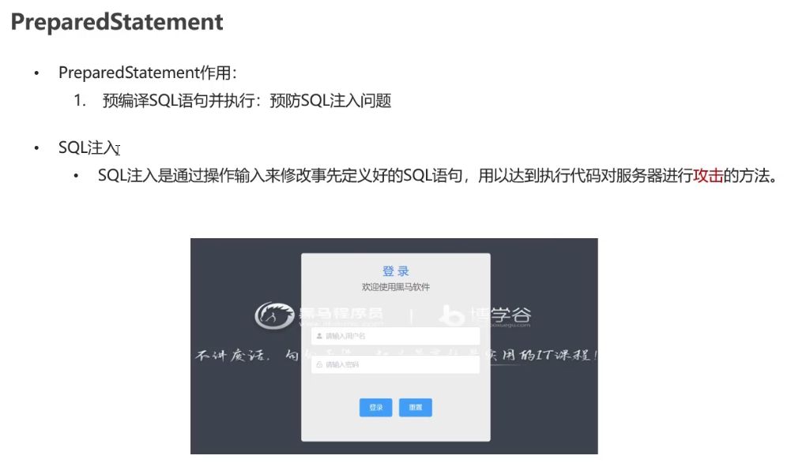

2. 如何解决SQL注入

	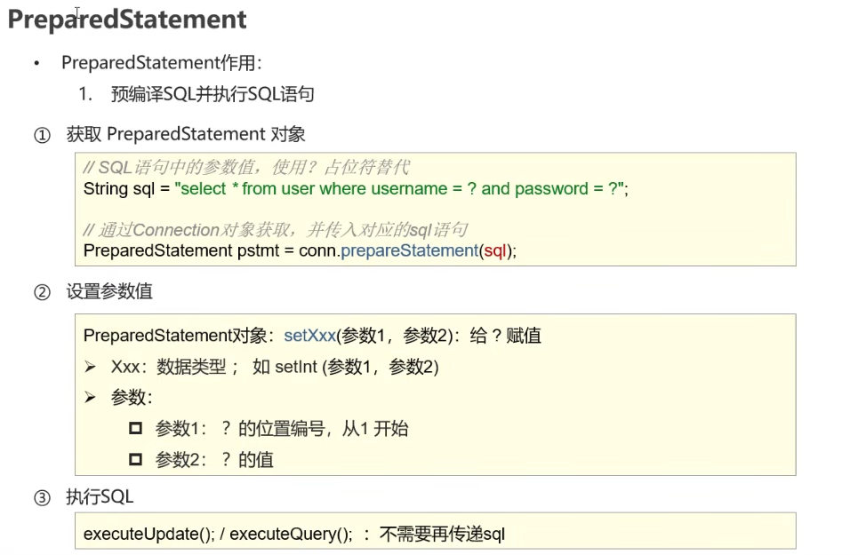

 3.  PreparedStatement原理

	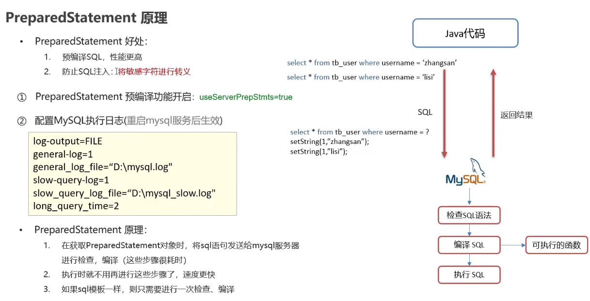

​	